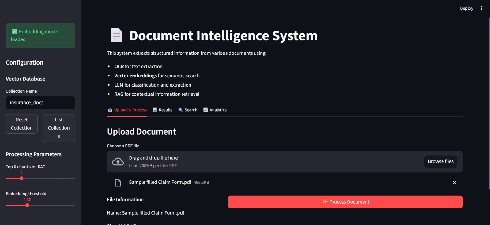
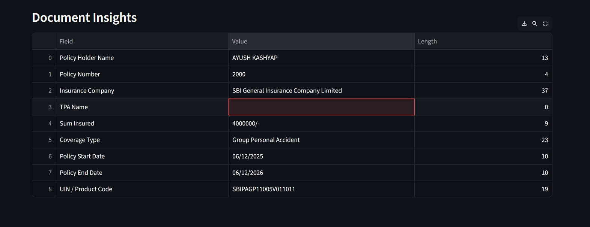
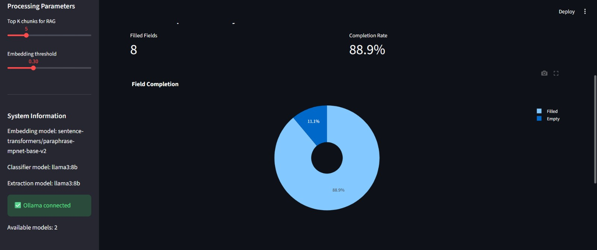

# AI-Powered Document Automation System  
### AI and Data Analytics for Governance


An **end-to-end AI-powered document processing pipeline** that automates OCR, classification, structured data extraction, summarization, and document-aware Q&A using **OCR, embeddings, vector databases, RAG, and local LLMs**.

Designed for **government and enterprise-grade workflows** with full **offline processing, data privacy, and audit readiness**.


## 📖 Project Overview

Government and enterprise organizations handle thousands of **unstructured documents** daily, such as insurance claims, legal notices, invoices, medical bills, and public service forms. Manual processing is slow, error-prone, and resource-intensive.

This project delivers a **fully local AI automation pipeline** that:

- Extracts text from scanned and digital PDFs
- Classifies document types
- Extracts structured fields using LLMs
- Generates AI-based summaries
- Enables document-specific Q&A using RAG
- Produces confidence scores for explainability

---

## 🏗️ System Architecture

The system follows a modular, end-to-end AI pipeline combining OCR, NLP, vector search, and LLM reasoning.

### 📊 Architecture & Processing Flow Diagram


## 🖥️ Frontend Interface


### Document Upload & Configuration


### Extracted Document Insights


## 📊 Analytics & Field Completion

### Field Completion Analysis


## 📤 Structured JSON Output

### LLM-Based Structured Extraction


---

## 🔁 Processing Flow

1. **Frontend UI**
   - Upload PDF
   - View extracted JSON
   - Chat with document

2. **Document Ingestion**
   - Receives PDF file

3. **OCR & Text Extraction**
   - PyMuPDF for text-based PDFs
   - Tesseract OCR for scanned PDFs
   - Outputs cleaned raw text

4. **Text Chunking**
   - ~1000 character chunks
   - Overlapping context
   - Preprocessing for embeddings

5. **Embedding Generation**
   - SentenceTransformer (`all-MiniLM-L6-v2`)
   - - SentenceTransformer (`paraphrase-multilingual-mpnet-base-v2`)
   - Converts chunks into vector embeddings

6. **Vector Database**
   - ChromaDB
   - Stores embeddings, chunks, metadata
   - Enables semantic retrieval

7. **Document Classification (Hybrid)**
   - Embedding-based similarity matching
   - LLM-based classification (Ollama)
   - Outputs document category

8. **Category-Specific Extraction**
   - Custom prompts per document type
   - RAG-based context grounding
   - Strict JSON structured output

9. **Confidence Scoring**
   - Weighted scoring mechanism
   - Classification + extraction confidence
   - Flags low-confidence sections

10. **Final JSON Output**
    - Document category
    - Extracted structured fields
    - Confidence score

11. **RAG Chatbot (Optional)**
    - User asks questions
    - Retrieves relevant chunks
    - Local LLM answers strictly from document context

---

## ✨ Key Features

- ✅ OCR for scanned & image-based PDFs
- ✅ Hybrid document classification
- ✅ LLM-based structured extraction
- ✅ Retrieval-Augmented Generation (RAG)
- ✅ Document-aware chatbot
- ✅ Confidence scoring & explainability
- ✅ Fully offline & privacy-preserving
- ✅ Modular and scalable design

---

## 🧰 Technology Stack

| Layer | Technology |
|-----|-----------|
| Language | Python 3.10+ |
| OCR | Tesseract OCR, PyMuPDF |
| Embeddings | SentenceTransformer |
| Vector DB | ChromaDB |
| LLM | Ollama (Mistral / LLaMA) |
| Backend | FastAPI |
| Retrieval | RAG Pipeline |
| Storage | JSON / Local DB |
| Frontend | React / HTML (optional) |

---

## ⚙️ Installation & Setup

## 🧠 Ollama LLM Setup (Local Models)

This project uses **Ollama** to run **local Large Language Models (LLMs)** for:
- Document classification
- Structured data extraction
- Summarization
- RAG-based document Q&A

Using Ollama ensures **offline execution, zero API cost, and full data privacy**.

---

### 🔹 Step 1: Install Ollama

Download and install Ollama for your operating system:

👉 https://ollama.com/download

Verify installation:

ollama --version
ollama pull mistral

ollama pull llama3

ollama run llama3

```bash
# ⚙️ Environment Setup & Project Execution

This project uses a **Conda virtual environment** for dependency isolation and reproducibility.

---

## 🐍 Conda Virtual Environment Setup

### 1️⃣ Create Environment

conda create -n rag-gemini python=3.11 -y

conda activate rag-gemini

pip install google-genai chromadb pypdf python-dotenv ipykernel

python -m ipykernel install --user --name rag-gemini --display-name "Python 3.11 (rag-gemini)"


### 1️⃣ Clone Repository

git clone <repository-url>

pip install requirements.txt

streamlit run app.py

